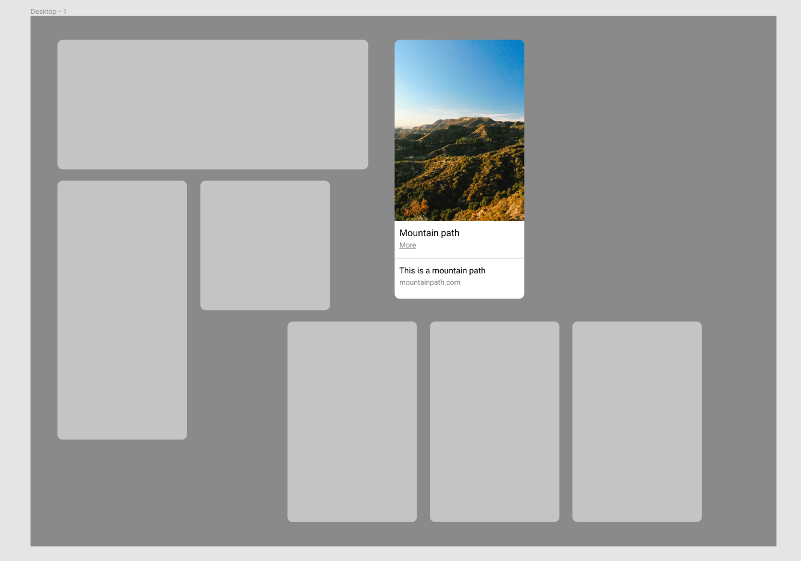

# Interaction design

## Contents

[Introduction](#Introduction)

[1. Modals](#Modals)
  * Research
  * Evaluation of guidelines
  * Planning and design prototype
  * Coding
  * Walkthrough
  * Reflection

[2. Buttons](#Buttons)
  * Research
  * Evaluation of guidelines
  * Planning and design prototype
  * Coding
  * Walkthrough
  * Reflection
  
[3. Cards](#Cards)
  * Research
  * Evaluation of guidelines
  * Planning and design prototype
  * Coding
  * Walkthrough
  * Reflection
  
[4. Search bar](#Search-Bar)
  * Research
  * Evaluation of guidelines
  * Planning and design prototype
  * Coding
  * Walkthrough
  * Reflection

[5. Toggle](#Toggle)
  * Research
  * Evaluation of guidelines
  * Planning and design prototype
  * Coding
  * Walkthrough
  * Reflection

## Introduction

In this document we explore 5 important components of design, the important factors that make the component a success and putting that into practice with the creation of the components through the use of react. These components help to solve real world issues and are widely used across multiple applications.

## Modals

### Research

What's a modal? Modals are windows that display in front of an applications main window, it keeps the main application window visible but at the same time disables it focusing the user on the content of the modal. This forces the user to interact with the modal window before they can return to the main application window. 

Usage: 
*   When you need to grab the users attention
*   When you need the user to input something
*   To show additional information in context/not in context

Modals are made up of different components usually consisting of a title, a shadow over the page behind, a close button, a button label and the main content.

(Baskanderi 2017; Sebastian 2018) 

### Evaluation of guidelines

Most websites have some form of newsletter sign up and one way to get users to sign up to your newsletter is to make it the most prominent thing on the screen. So I decided to theme this modal as a newsletter sign up. By doing this it gives the user little choice when joining the website or application on what they do first.

The modal is made so that the content of the website is obscured and the modal is the only thing visible in the middle. The user can close the modal by using the x button or they can click anywhere on the gray background outside the modal. The modal can adjust well to different screen sizes and has a transition effect when the user closes the window.

### Planning and design prototype

The prototype was conceived on figma with the idea of making a newsletter signup modal. There is a big background with images of letters to give it the mail feel. The modal comprises of a title, a short description of what the modal is about and a field for the user to input their email address and a button to submit it.

### Coding

### Walkthrough

### Reflection

By using a modal we can decrease the amount of stuff crowding the screen when the user looks at the website. It also focuses the user into this specific part of the website and could increase the number of users signing up to the newsletter. Modals are easy and compatible with all platforms and screens which makes it a good method for catching a users attention.

Carrying out research into text boxes helped with the sizing of the box that the email is entered into and research into buttons helped with the sizing and type of the button.

## Buttons

### Research

Buttons are used when you carry out an action. These actions are mainly: submit, merge, create new, upload, media such as pause and play, etc. Buttons can consist of either just an icon, just text or both. 

Buttons should have the correct interactions when a user comes to use it and clear defined styles from the background. Buttons must have clear states that distinguish it from other states around the site or application but should not have too much visual noise.

Buttons can consist of different states such as normal, focus, hover effect, active, progress/loading, disabled. Buttons can also be various shapes and sizes for different applications and can often come in groups of buttons.

(Anon. 2019; Bakusevych 2020) 

### Evaluation of guidelines

Buttons are actionable boxes with text in and are used for a range of applications such as;
*   Dialogs
*   Modal windows
*   Forms
*   Cards
*   Toolbars

To make buttons user friendly they should clearly indicate they can perform an action, they should be easy to find and easily usable, especially on smaller screen sizes and also they should be clearly defined to show their state and action.

For buttons to be designed well the text should remain on a single line, use capital letters in order to make things clear and to help with spacing.

(Anon. a) 

### Planning and design prototype

Buttons can have different states so this was important to show and display when coding the component. I also needed to ensure that the buttons were of a good size so that the user can easily use them across multiple devices and screen sizes. It should be placed in a comfortable position for users of touch screen devices because they do not want to be reaching all over the place to click a button.

Buttons can match the colour theme of a website or they can be in grayscale. Determining the colour of a button relates to button emphasis. There are three types; high, medium and low. High is the full bold colour of the website, one that ties in with the theme. Medium is a slightly muted more faded shade of the colour and low is grayscale. They have different working states such as disabled, loading, active, passive.

Buttons should never hug the text, rather they should have padding inside the button to ensure that it is big enough for the user to use and so that it looks good. Buttons also need some sort of animation that indicates that the user is on top of the clickable area, such as a change in colour when hovering.

(Anon. b) Google material design - buttons ) 

### Coding

### Walkthrough

### Reflection

Buttons are of fundamental importance in web design as they are used on almost every website, whether it be on the navigation or through the website, on a modal or on social media it has such a wide range of uses and applications, styles and formats.

Buttons are so important to creating an application from the design of it to the functionality, the user instantly knows what it is as they are so widely and commonly used.

## Cards

### Research

Cards can be used for displaying different things on a website such as pricing plans. They can also be used on social sites such as pinterest. Cards are great because they can accommodate responsive design, meaning they can be used for a wide variety of applications.

Cards can help users to quickly read through information in a broken down form and extract what matters the most. Cards can be altered for different applications like on a mobile device they can go vertically instead of being displayed horizontally.

Cards can be used for multiple forms of displaying components such as galleries, textual content, downloadable content, audio, video and other things.

(Downs 2020); (Anon. c) - Google material design - Cards anatomy; (Laubheimer 2016) 

### Evaluation of guidelines

Cards are widely used for all sorts of applications, mainly however in social media or to display a pricing plan or structure. They consist of a few main components such as an image, a title, somebody text and maybe a link or button at the bottom of the card although sometimes the card can be the link or button itself.

Cards are good because they stick up away from the main body of the application and allow certain information to be condensed and eye catching to the user. Cards make it easier for the user to interact with the website and help with the usability and experience.

Pinterest is a good example of a social media website that uses cards to display images and text. These cards are super responsive and means that they work on all screen sizes well. In the case of pinterest they are good because it allows users to make customised moodboards for any application from the photos users have uploaded to the platform.

### Planning and design prototype

When designing the card I thought of making a sort of basic card displaying a picture with a short description. This could have a wide range of applications for example, displaying a hotel room with the option to book.

This is a screenshot from the premier inn website showing a collection of cards to allow users to “discover” their hotels.

(Premier inn website, [https://www.premierinn.com/gb/en/home.html](https://www.premierinn.com/gb/en/home.html), viewed on friday 8th Jan 2020)

It makes the user experience of browsing the website easier and less overwhelming to read and use. In the screenshot below are the card designs I came up with showing some different layouts that cards can have:

### Coding

### Walkthrough 

### Reflection

When designing the cards I had to ensure that they were functional and looked good to the user. The cards needed to be eye catching but also have minimal information on them. They also needed to respond to different layouts and screen sizes easily so no irregular shapes were used.

Cards are good for a wide range of applications. What I would have done differently is created and coded a group of cards for example a set of three. This is because they rarely come as a one off thing. I would have designed the cards displaying a pricing structure of a subscription service as I feel this would have been a better example.

## Search Bar

### Research

When it comes to designing a search bad simplicity is key. The user needs to be able to see the search bar clearly, if the user has to find the search bar it can make them confused and frustrated. In a study conducted by A. Dawn Shaikh and Keisi Lenz, which included 142 participants, showed that users expected the search bar to be the top left or top right.

Designing the length of a search box is an important factor. When a user comes to type in a search query they will want to check what they have entered into the box to make it easier to review and edit what they have entered. When a search box is smaller users usually enter a smaller number of words as longer searches would be harder to read. This is why search boxes should be sized to their average expected input, so “27 characters text input size accommodates 90% of queries”.

(Babich 2020) 

### Evaluation of guidelines

In evaluation, search bars need to accommodate a good size of query to ensure that the user is comfortable when using it. Search bars are easily made responsive and can be styled in many ways such as border, background colour, text colour, padding and margins, and text size.

Search bars are useful when a user needs to search for something on a website. They are widely used on ecommerce stores so that the user can filter down the results to find exactly what they are looking for.

It is important to include an icon for the user to click when they want to submit their query along with a word so that the button is easily clickable on all devices.

### Planning and design prototype

When prototyping I made sure that the size of the search box was 27 characters long at size 18 font with a padding of 20px. I chose to do the search box this long because then it can accommodate most of the queries a user needs to search.

The padding helped make the text box more visually appealing and I've added colour to the box too. Positioning the search bar at the top either to the left or the right is where most users expect it to be so that was a must when designing this.

### Coding

### Walkthrough

### Reflection

Search bars are an important component on most websites. What I could have done differently is code some cards that hold information or some product cards to filter through on the website to make it more of a realistic scenario.

By using icons it can make it easier for a user to make a decision on the website and the magnifying glass is a widely used icon that all users know about.

## Toggle

### Research

Dark and light mode is a useful tool in the current day with an increase of people using their mobile devices. More and more people are turning them for their daily tasks which also has people using them in darker environments.

Some people also prefer the use of dark mode over the light version as it appeals to them more from a visual point of view. Dark mode has been liked by so many people that android and IOS now have a built in dark mode for its users.

According to Cox, dark mode ensures a higher contrast between the text and the background, which is more important than a colour scheme. However, research published by Cosima Piepenbrock and Susanne Mayr proved that people could pick out more mistakes and focus on the text more if it was black text on a white background.

(Clarke 2019) 

### Evaluation of guidelines

To help with eye strain, dark mode can be used when a user is in a dark room or place or if they are using their device at night time. 

While dark mode isn't essential it is a very deserted and useful part of an application. It is good to give the user of the website a choice and customizability over the web page in terms of background as it can help improve user satisfaction.

### Planning and design prototype

When planning this component the design is fairly simple. The page needs to turn from white white or light background and dark text to the opposite, light coloured text and dark background.

I decided to make the text size fairly big at 18px to allow for easy accessibility and reading for the user when typing in their query.

Keeping the text and background easy to read with a high contrast was an essential part of the design of the search bar so that the user can easily see it. The button for the search bar in the design could either be an arrow indicating a go action or a magnifying glass indicating a search function. To show that the user has clicked in the search box the cursor will show as though they are about to type and the outline of the box changes to a lighter colour.

### Coding

### Walkthrough

### Reflection

Dark mode solves the problem of eye strain and bright screens for the user when using in a setting where the light levels are low or non existent. Next time I would incorporate the use of a toggle switch when creating this component as it is easier and more simple for the user to understand when coming to use the component. It would give a more minimalistic feeling to the website, especially if the use of logos or graphics could be used on the switch from light to dark.

## References

ANON., 2019. 8 Important Rules For Perfect Button Design. In: _Digital Synopsis. _-07-24T15:42:42+00:00 [viewed Jan 8, 2021]. Available from: https://digitalsynopsis.com/design/ui-button-design-rules/

BABICH, N., 2020. _Design a Perfect Search Box _[viewed Jan 8, 2021]. Available from: https://uxplanet.org/design-a-perfect-search-box-b6baaf9599c

BAKUSEVYCH, T., 2020. _The anatomy of a button — UI component series _[viewed Jan 8, 2021]. Available from: https://uxdesign.cc/button-design-user-interface-components-series-85243b6736c7

BASKANDERI, N., 2017. _Best Practices for Modals / Overlays / Dialog Windows _[viewed Jan 8, 2021]. Available from: https://uxplanet.org/best-practices-for-modals-overlays-dialog-windows-c00c66cddd8c

_Buttons _a. [viewed Jan 8, 2021]. Available from: https://material.io/components/buttons

_Buttons _b. [viewed Jan 8, 2021]. Available from: https://material.io/components/buttons#hierarchy-and-placement

_Cards _c. [viewed Jan 8, 2021]. Available from: https://material.io/components/cards#anatomy

CLARKE, L., 2019. Dark mode isn't as good for your eyes as you believe. _Wired UK, _-07-30

DOWNS, J., 2020. _Card UI design: fundamentals and examples _[viewed Jan 8, 2021]. Available from: https://www.justinmind.com/blog/cards-ui-design/

LAUBHEIMER, P., 2016. _Cards: UI-Component Definition _[viewed Jan 8, 2021]. Available from: https://www.nngroup.com/articles/cards-component/

SEBASTIAN, F., 2018. _Modality Is the One UX Concept That Most Designers Don’t Fully Understand _[viewed Jan 8, 2021]. Available from: https://uxplanet.org/modality-the-one-ux-concept-you-need-to-understand-when-designing-intuitive-user-interfaces-e5e941c7acb1
